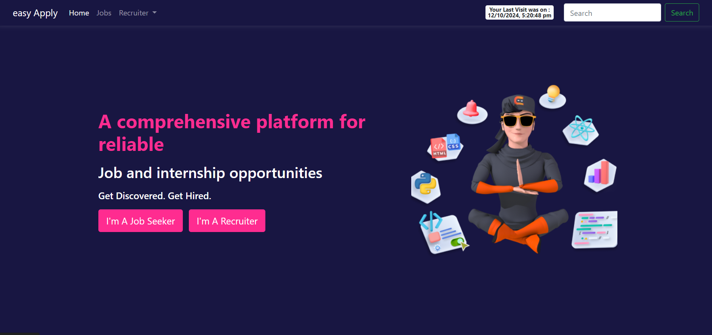

# Job Portal Web Application

This project is a Job Portal web application built using Node.js and Express. It allows users to register, log in, and apply for jobs while providing functionalities for employers to post and manage job listings.



## Features

- User registration and login
- Job posting and management
- Job search functionality with filtering options
- View job details
- Apply for jobs with resume upload
- Applicant management
- Middleware for authentication and validation

## Technologies Used

- **Node.js**: Server-side JavaScript runtime
- **Express**: Web framework for Node.js
- **EJS**: Templating engine for rendering HTML views
- **MongoDB**: Database for storing user and job data
- **Multer**: Middleware for handling file uploads
- **Express-session**: Middleware for session management
- **Cookie-parser**: Middleware for cookie management

## Installation

1. Clone the repository:

   ```bash
   git clone https://github.com/yourusername/job-portal.git
   cd job-portal
   ```
